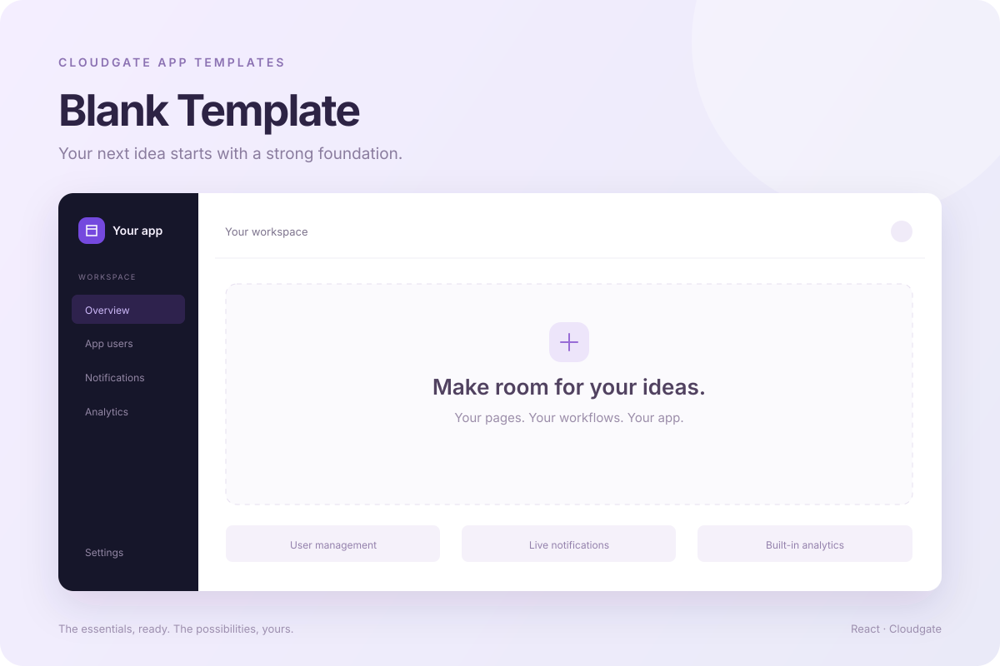

# Cloudgate App Templates

This repository contains **Blank Template**, a reusable app foundation for the [Cloudgate](https://cloudgate.dev) Quick Start gallery and Cloudgate App Launcher.

`blank-template/` is the application customers receive. Cloudgate Launcher owns the setup journey in its separate repository at `D:/repos/AzureDevOps/Cloudgate Launcher`. The projects have independent dependencies, assets and builds.



[View the live app](https://admin.app.cloudgate.dev/)

## Blank Template

A polished React 18, Vite and Tailwind foundation with native Cloudgate back-office capabilities:

- Tenant IdP user management and administrator access controls.
- Website analytics and application-scoped workflow logs.
- Custom branding, appearance, light/dark/system themes and density settings.
- Tenant SMTP settings and a media library.
- About information and Cloudgate Wallet payment readiness.
- Responsive navigation, soft surfaces and page, modal and button transitions.
- Dashboard and Orders placeholders for application-specific features.

The template includes an empty controller definition for native API application scope. It contains no sample workflow actions, app database or seeded business records. See the [template setup guide](./blank-template/README.md) for backend requirements, controller configuration and upgrades.

## Use the template

Open **Web Coder → Quick Start** (`/web-coder`) in the Cloudgate hub and select **Blank Template**. The gallery card shows the banner, description, live demo and source links; **Use this template** copies the app into your workspace.

For local development, configure `blank-template/.env` using `blank-template/.env.example`, then run:

```sh
cd blank-template
npm install
npm run dev
```

Create a production build with `npm run build` and publish the `blank-template/dist/` output. Static hosting must fall back to `index.html` for application routes.

## Repository layout

```text
templates.json       # GitHub catalogue entry for Blank Template
blank-template/      # Reusable app template
  template.json      # App metadata and installation configuration
  banner.svg         # Blank Template gallery preview
  .template/         # Empty controller bundle and setup notes
  src/               # Application source
  tests/             # API and browser checks
```

## Gallery metadata

Keep the Blank Template entry in `templates.json` aligned with `blank-template/template.json`, including its ID, name, folder, description, tags and banner URL. The gallery copies only the `blank-template/` folder. The launcher displays names directly from this catalogue.

Keep generated files such as `node_modules/` and `dist/` out of Git. After changes are merged and pushed to `main`, the gallery uses the updated metadata when it refreshes.

## Checks

```sh
cd blank-template
npm test
npm run test:ui
npm run build
```

The [template README](./blank-template/README.md#checks) documents browser setup and the checks' scope.
