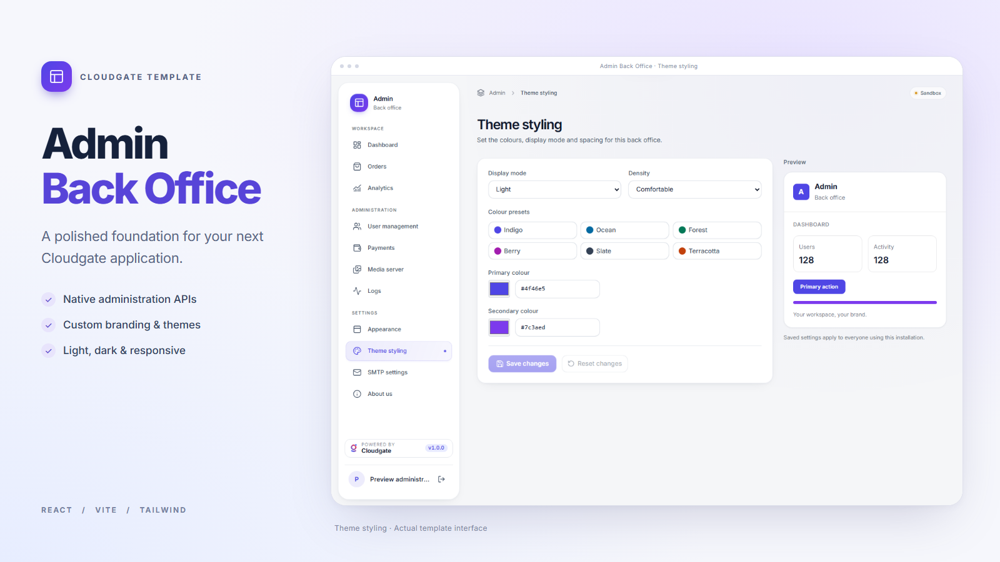

# Cloudgate App Templates

The official **Admin Back Office** skeleton for the [Cloudgate](https://cloudgate.dev) Web Coder Quick Start gallery. This repository contains the `admin/` app only.



## Admin Back Office

A polished React 18, Vite and Tailwind foundation with native Cloudgate back-office capabilities:

- Tenant IdP user management and administrator access controls.
- Website analytics and application-scoped workflow logs.
- Custom branding, appearance, light/dark/system themes and density settings.
- Tenant SMTP settings and a media library.
- About information and Cloudgate Wallet payment readiness.
- Responsive navigation, soft surfaces and page, modal and button transitions.
- Dashboard and Orders placeholders for application-specific features.

The template includes an empty controller definition for native API application scope. It contains no sample workflow actions, app database or seeded business records. See the [Admin setup guide](./admin/README.md) for backend requirements, controller configuration and upgrades.

## Use the template

Open **Web Coder → Quick Start** (`/web-coder`) in the Cloudgate hub and select **Admin Back Office**. The gallery card shows the banner, description and source link; **Use this template** copies the app into your workspace.

For local development, configure `admin/.env` using `admin/.env.example`, then run:

```sh
cd admin
npm install
npm run dev
```

Create a production build with `npm run build` and publish the `admin/dist/` output. Static hosting must fall back to `index.html` for application routes.

## Repository layout

```text
templates.json       # Quick Start gallery entry for Admin Back Office
admin/               # Reusable back-office skeleton
  template.json      # App metadata and installation configuration
  banner.png         # Gallery banner captured from the current interface
  .template/         # Empty controller bundle and setup notes
  src/               # Application source
  tests/             # API and browser checks
```

## Gallery metadata

Keep the Admin entry in `templates.json` aligned with `admin/template.json`, including its name, description, tags and banner URL. The gallery copies only the `admin/` folder.

Keep generated files such as `node_modules/` and `dist/` out of Git. After changes are merged and pushed to `main`, the gallery uses the updated metadata when it refreshes.

## Checks

```sh
cd admin
npm test
npm run test:ui
npm run build
```

The [Admin README](./admin/README.md#checks) documents browser setup and the checks' scope.
