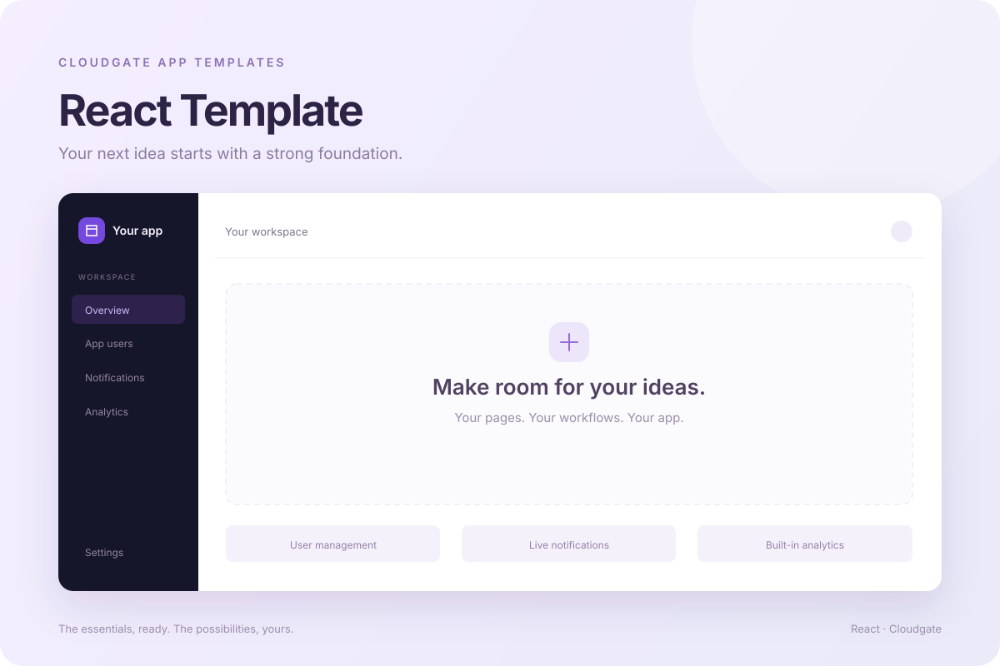

# Cloudgate App Templates

This repository contains **React Template**, a blank React app foundation for the [Cloudgate](https://cloudgate.dev) Quick Start gallery and Cloudgate App Launcher.

`react-template/` is the application customers receive. Templates use framework-specific folders so future templates, such as `angular-template/`, can sit alongside it. Cloudgate Launcher owns the setup journey in its separate repository at `D:/repos/AzureDevOps/Cloudgate Launcher`. The projects have independent dependencies, assets and builds.



[View the live app](https://admin.app.cloudgate.dev/)

## React Template

A polished React 18, Vite and Tailwind foundation with native Cloudgate back-office capabilities:

- Tenant IdP user management and administrator access controls.
- Website analytics and application-scoped workflow logs.
- Custom branding, appearance, light/dark/system themes and density settings.
- Tenant SMTP settings and a media library.
- About information and Cloudgate Wallet payment readiness.
- Responsive navigation, soft surfaces and page, modal and button transitions.
- One Example page placeholder, with guidance to the Developers tools in the bottom bar.

The template uses native Cloudgate APIs and contains no sample workflow actions, app database or seeded business records. Open **Developers** in the bottom bar to start building your app. See the [template setup guide](./react-template/README.md) for backend requirements, configuration and upgrades.

## Use the template

Open **Web Coder → Quick Start** (`/web-coder`) in the Cloudgate hub and select **React Template**. The gallery card shows the banner, description, live demo and source links; **Use this template** copies the app into your workspace.

For local development, configure `react-template/.env` using `react-template/.env.example`, then run:

```sh
cd react-template
npm install
npm run dev
```

Create a production build with `npm run build` and publish the `react-template/dist/` output. Static hosting must fall back to `index.html` for application routes.

## Repository layout

```text
templates.json       # GitHub catalogue of framework-specific templates
react-template/      # Blank React app template
  template.json      # App metadata and installation configuration
  banner.svg         # React Template gallery preview
  .template/         # Setup notes and environment reference
  src/               # Application source
  tests/             # API and browser checks
```

## Gallery metadata

Keep the React Template entry in `templates.json` aligned with `react-template/template.json`, including its ID, name, folder, description, tags and banner URL. The gallery copies only the `react-template/` folder. The launcher displays names directly from this catalogue.

Keep generated files such as `node_modules/` and `dist/` out of Git. After changes are merged and pushed to `main`, the gallery uses the updated metadata when it refreshes.

## Checks

```sh
cd react-template
npm test
npm run test:ui
npm run build
```

The [template README](./react-template/README.md#validate-and-release) documents browser setup and the checks' scope.
